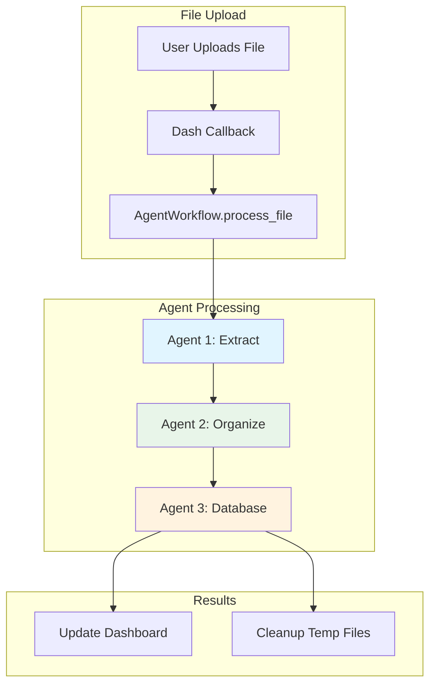
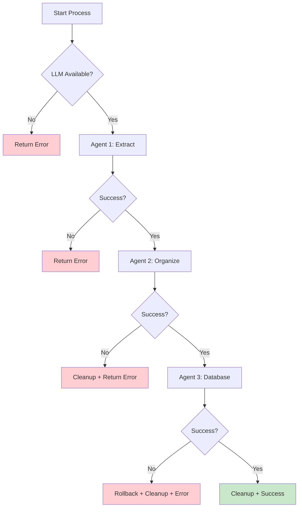

# Agent Workflow Technical Guide

This document provides a deep technical dive into how the three-agent system processes financial documents.

## Overview

The agent workflow is implemented in `agents.py` and orchestrated by the `AgentWorkflow` class.



## AgentWorkflow Orchestrator

### Initialization

```python
class AgentWorkflow:
    def __init__(self):
        # Initialize LLM (loads model automatically)
        self.llm = LLMHandler()
        
        # Create specialized agents
        self.extractor = ExtractionAgent(self.llm)
        self.organizer = OrganizerAgent(self.llm)
        self.db_agent = DatabaseAgent(self.llm)
        
        # Create temporary directories
        self.temp_dir = Path("data/temp")
        self.temp_dir.mkdir(parents=True, exist_ok=True)
```

### Main Process Flow

```python
def process_file(self, file_path: str, original_filename: str) -> Dict:
    """
    Full pipeline: Extract → Organize → Database
    """
    try:
        # Generate unique session ID
        session_id = datetime.now().strftime("%Y%m%d_%H%M%S")
        
        # Phase 1: Extraction
        output_1 = self.extractor.extract(file_path, original_filename, session_id)
        output_1_path = self.temp_dir / f"output_1_{session_id}.json"
        self._save_json(output_1, output_1_path)
        
        # Phase 2: Organization
        organized_files = self.organizer.organize(output_1_path, session_id)
        
        # Phase 3: Database
        total_records = 0
        for organized_file in organized_files:
            records = self.db_agent.write_to_db(organized_file)
            total_records += records
        
        # Cleanup
        self._cleanup_session(session_id)
        
        return {
            "success": True,
            "records": total_records,
            "session_id": session_id
        }
    except Exception as e:
        return {
            "success": False,
            "error": str(e)
        }
```

## Agent 1: ExtractionAgent 🔍

### Purpose

Universal document reader that handles CSV, PDF, and text files.

### Code Structure

```python
class ExtractionAgent:
    def __init__(self, llm_handler: LLMHandler):
        self.llm = llm_handler
        
    def extract(self, file_path: str, filename: str, session_id: str) -> Dict:
        """
        Extract data from any file format
        """
        file_type = Path(file_path).suffix.lower()
        
        # Step 1: Read raw data
        if file_type == '.csv':
            raw_data = self._read_csv(file_path)
        elif file_type == '.pdf':
            raw_data = self._read_pdf(file_path)
        else:
            raw_data = self._read_text(file_path)
        
        # Step 2: Enhance with LLM
        enhanced = self._enhance_with_llm(raw_data, file_type)
        
        # Step 3: Build output
        return {
            "filename": filename,
            "file_type": file_type,
            "session_id": session_id,
            "extracted_at": datetime.now().isoformat(),
            "raw_data": raw_data,
            "enhanced_data": enhanced
        }
```

### CSV Extraction

```python
def _read_csv(self, file_path: str) -> Dict:
    """
    Read CSV with pandas
    """
    df = pd.read_csv(file_path)
    
    return {
        "type": "csv",
        "rows": df.to_dict(orient='records'),
        "columns": df.columns.tolist(),
        "row_count": len(df)
    }
```

### PDF Extraction

```python
def _read_pdf(self, file_path: str) -> Dict:
    """
    Extract text from PDF with pdfplumber
    """
    with pdfplumber.open(file_path) as pdf:
        text = ""
        for page in pdf.pages:
            text += page.extract_text() or ""
    
    return {
        "type": "pdf",
        "text": text,
        "text_length": len(text)
    }
```

### LLM Enhancement

This is where the magic happens - the LLM analyzes the raw data:

```python
def _enhance_with_llm(self, raw_data: Dict, file_type: str) -> Dict:
    """
    Use LLM to understand document structure and content
    """
    # Build context for LLM
    if raw_data["type"] == "csv":
        context = f"CSV with columns: {raw_data['columns']}\n"
        context += f"Sample rows:\n{json.dumps(raw_data['rows'][:5], indent=2)}"
    else:
        context = raw_data["text"][:3000]  # Limit context size
    
    # Create analysis prompt
    prompt = f"""[INST] Analyze this financial document and extract key information.

Identify:
1. Document type (bank_statement, credit_card, invoice, budget, receipt, etc.)
2. Date range or relevant dates (use YYYY-MM-DD format)
3. Account information (if present)
4. Currency (USD, EUR, etc.)
5. Key financial entities present (transactions, balances, budgets, etc.)

Return ONLY valid JSON with these fields:
{{
    "document_type": "type here",
    "date_range": "range or single date",
    "account_info": "account details or null",
    "currency": "currency code",
    "entities": ["list", "of", "entities"]
}}

Context:
{context}

[/INST]"""
    
    # Get LLM response
    response = self.llm.generate(prompt, temperature=0.1)
    
    try:
        analysis = json.loads(response)
        return {"llm_analysis": analysis}
    except json.JSONDecodeError:
        # Fallback if LLM doesn't return valid JSON
        return {"llm_analysis": None, "raw_response": response}
```

### Output Format

**output_1_{session_id}.json**:

```json
{
  "filename": "chase_statement.pdf",
  "file_type": ".pdf",
  "session_id": "20251007_154523",
  "extracted_at": "2025-10-07T15:45:23.123456",
  "raw_data": {
    "type": "pdf",
    "text": "CHASE BANK Statement Period: 09/01/2025 - 09/30/2025...",
    "text_length": 5432
  },
  "enhanced_data": {
    "llm_analysis": {
      "document_type": "bank_statement",
      "date_range": "2025-09-01 to 2025-09-30",
      "account_info": "Checking Account ****1234",
      "currency": "USD",
      "entities": ["transactions", "account_balance"]
    }
  }
}
```

## Agent 2: OrganizerAgent 📊

### Purpose

Convert unstructured extraction into structured, normalized data records.

### Code Structure

```python
class OrganizerAgent:
    def __init__(self, llm_handler: LLMHandler):
        self.llm = llm_handler
        
    def organize(self, output_1_path: Path, session_id: str) -> List[Path]:
        """
        Create organized JSON files for each data type
        """
        # Load extraction output
        with open(output_1_path) as f:
            data = json.load(f)
        
        # Identify data types present
        entities = data["enhanced_data"]["llm_analysis"]["entities"]
        
        organized_files = []
        for entity in entities:
            if entity == "transactions":
                file_path = self._organize_transactions(data, session_id)
                organized_files.append(file_path)
            elif entity == "budgets":
                file_path = self._organize_budgets(data, session_id)
                organized_files.append(file_path)
            # Add more entity types as needed
        
        return organized_files
```

### Transaction Organization

```python
def _organize_transactions(self, data: Dict, session_id: str) -> Path:
    """
    Extract and normalize transaction records
    """
    # Get raw content
    if data["raw_data"]["type"] == "csv":
        raw_content = json.dumps(data["raw_data"]["rows"], indent=2)
    else:
        raw_content = data["raw_data"]["text"][:4000]
    
    # Create extraction prompt
    prompt = f"""[INST] Extract ALL financial transactions from this document.

For each transaction, extract:
- date: Transaction date in YYYY-MM-DD format
- amount: Number (negative for expenses, positive for income)
- description: What the transaction was for
- category: Best guess category (Groceries, Dining, Transport, etc.)

Return ONLY valid JSON array:
[
    {{"date": "2025-09-15", "amount": -45.67, "description": "Whole Foods", "category": "Groceries"}},
    {{"date": "2025-09-16", "amount": -12.50, "description": "Coffee Shop", "category": "Dining"}}
]

Context:
{raw_content}

[/INST]"""
    
    # Get LLM response
    response = self.llm.generate(prompt, temperature=0.1)
    
    try:
        transactions = json.loads(response)
    except json.JSONDecodeError:
        # Try to extract JSON from response
        transactions = self._extract_json_array(response)
    
    # Validate and normalize
    transactions = self._validate_transactions(transactions)
    
    # Build organized output
    output = {
        "data_type": "transactions",
        "records": transactions,
        "metadata": {
            "source_file": data["filename"],
            "extracted_at": datetime.now().isoformat(),
            "record_count": len(transactions),
            "session_id": session_id
        }
    }
    
    # Save to file
    output_path = Path("data/temp") / f"organized_transactions_{session_id}.json"
    with open(output_path, 'w') as f:
        json.dump(output, f, indent=2)
    
    return output_path
```

### Validation

```python
def _validate_transactions(self, transactions: List[Dict]) -> List[Dict]:
    """
    Ensure all transactions have required fields and valid values
    """
    validated = []
    for txn in transactions:
        # Check required fields
        if not all(k in txn for k in ["date", "amount", "description"]):
            continue
        
        # Normalize date
        try:
            # Try parsing various date formats
            date = pd.to_datetime(txn["date"]).strftime("%Y-%m-%d")
            txn["date"] = date
        except:
            continue
        
        # Ensure amount is numeric
        try:
            txn["amount"] = float(txn["amount"])
        except:
            continue
        
        # Add default category if missing
        if "category" not in txn or not txn["category"]:
            txn["category"] = "Uncategorized"
        
        validated.append(txn)
    
    return validated
```

### Output Format

**organized_transactions_{session_id}.json**:

```json
{
  "data_type": "transactions",
  "records": [
    {
      "date": "2025-09-15",
      "amount": -45.67,
      "description": "Whole Foods Market #123",
      "category": "Groceries"
    },
    {
      "date": "2025-09-16",
      "amount": -12.50,
      "description": "Coffee Shop Downtown",
      "category": "Dining"
    },
    {
      "date": "2025-09-20",
      "amount": 3500.00,
      "description": "Salary Deposit",
      "category": "Income"
    }
  ],
  "metadata": {
    "source_file": "chase_statement.pdf",
    "extracted_at": "2025-10-07T15:45:25.654321",
    "record_count": 42,
    "session_id": "20251007_154523"
  }
}
```

## Agent 3: DatabaseAgent 💾

### Purpose

Dynamically manage database schema and write records transactionally.

### Code Structure

```python
class DatabaseAgent:
    def __init__(self, llm_handler: LLMHandler):
        self.llm = llm_handler
        
    def write_to_db(self, organized_file_path: Path) -> int:
        """
        Write organized data to database with schema evolution
        """
        # Load organized data
        with open(organized_file_path) as f:
            data = json.load(f)
        
        data_type = data["data_type"]
        records = data["records"]
        
        if not records:
            return 0
        
        # Determine table name
        table_name = data_type  # e.g., "transactions", "budgets"
        
        # Step 1: Check if table exists
        if not self._table_exists(table_name):
            # Create new table based on first record
            self._create_table(table_name, records[0])
        else:
            # Check if schema needs updating
            self._update_schema_if_needed(table_name, records[0])
        
        # Step 2: Insert all records
        inserted = self._insert_records(table_name, records)
        
        return inserted
```

### Table Creation

```python
def _create_table(self, table_name: str, sample_record: Dict):
    """
    Create table based on record structure
    """
    # Infer column types from sample record
    columns = []
    for key, value in sample_record.items():
        sql_type = self._infer_sql_type(value)
        columns.append(f"{key} {sql_type}")
    
    # Add metadata columns
    columns.append("created_at TEXT DEFAULT CURRENT_TIMESTAMP")
    columns.append("updated_at TEXT DEFAULT CURRENT_TIMESTAMP")
    
    # Build CREATE TABLE statement
    columns_sql = ", ".join(columns)
    create_sql = f"""
    CREATE TABLE IF NOT EXISTS {table_name} (
        id INTEGER PRIMARY KEY AUTOINCREMENT,
        {columns_sql}
    )
    """
    
    # Execute
    conn = sqlite3.connect("data/finance.db")
    try:
        conn.execute(create_sql)
        conn.commit()
    finally:
        conn.close()
```

### Schema Evolution

```python
def _update_schema_if_needed(self, table_name: str, sample_record: Dict):
    """
    Add new columns if record has fields not in table
    """
    conn = sqlite3.connect("data/finance.db")
    try:
        # Get existing columns
        cursor = conn.execute(f"PRAGMA table_info({table_name})")
        existing_cols = {row[1] for row in cursor.fetchall()}
        
        # Find new columns
        record_cols = set(sample_record.keys())
        new_cols = record_cols - existing_cols
        
        # Add new columns
        for col in new_cols:
            sql_type = self._infer_sql_type(sample_record[col])
            alter_sql = f"ALTER TABLE {table_name} ADD COLUMN {col} {sql_type}"
            conn.execute(alter_sql)
        
        if new_cols:
            conn.commit()
    finally:
        conn.close()
```

### Type Inference

```python
def _infer_sql_type(self, value) -> str:
    """
    Infer SQL type from Python value
    """
    if isinstance(value, bool):
        return "INTEGER"  # SQLite uses INTEGER for booleans
    elif isinstance(value, int):
        return "INTEGER"
    elif isinstance(value, float):
        return "REAL"
    elif isinstance(value, (dict, list)):
        return "TEXT"  # Store as JSON string
    else:
        return "TEXT"
```

### Record Insertion

```python
def _insert_records(self, table_name: str, records: List[Dict]) -> int:
    """
    Insert records with transaction safety
    """
    conn = sqlite3.connect("data/finance.db")
    try:
        conn.execute("BEGIN TRANSACTION")
        
        inserted = 0
        for record in records:
            # Build INSERT statement
            columns = list(record.keys())
            placeholders = ", ".join("?" * len(columns))
            columns_sql = ", ".join(columns)
            values = [record[col] for col in columns]
            
            insert_sql = f"""
            INSERT INTO {table_name} ({columns_sql})
            VALUES ({placeholders})
            """
            
            conn.execute(insert_sql, values)
            inserted += 1
        
        conn.commit()
        return inserted
    except Exception as e:
        conn.rollback()
        raise e
    finally:
        conn.close()
```

## Cleanup & Lifecycle

### Session Cleanup

```python
def _cleanup_session(self, session_id: str):
    """
    Delete all temporary files for this session
    """
    temp_dir = Path("data/temp")
    
    # Find all files for this session
    session_files = list(temp_dir.glob(f"*{session_id}*"))
    
    for file_path in session_files:
        try:
            file_path.unlink()
        except Exception as e:
            print(f"Warning: Could not delete {file_path}: {e}")
```

### Error Handling



## Performance Optimization

### Caching Strategy

```python
class LLMHandler:
    def __init__(self):
        # Model stays in memory after first load
        self.llm = Llama(
            model_path=str(self.model_path),
            n_ctx=4096,
            n_threads=4,
            verbose=False
        )
```

### Batch Processing

For multiple files:

```python
def process_batch(self, file_paths: List[str]) -> List[Dict]:
    """
    Process multiple files efficiently
    """
    results = []
    
    # Model loads once at initialization
    for file_path in file_paths:
        result = self.process_file(file_path)
        results.append(result)
    
    return results
```

### Token Limits

```python
# Context truncation to avoid token limits
context = raw_text[:3000]  # ~750 tokens
```

## Testing

### Unit Tests

```python
def test_extraction_agent():
    llm = LLMHandler()
    agent = ExtractionAgent(llm)
    
    result = agent.extract("test_statement.csv", "statement.csv", "test_session")
    
    assert "raw_data" in result
    assert "enhanced_data" in result
    assert result["file_type"] == ".csv"
```

### Integration Tests

```python
def test_full_workflow():
    workflow = AgentWorkflow()
    
    result = workflow.process_file("test_files/sample.pdf", "sample.pdf")
    
    assert result["success"] == True
    assert result["records"] > 0
    
    # Check database
    conn = sqlite3.connect("data/finance.db")
    cursor = conn.execute("SELECT COUNT(*) FROM transactions")
    count = cursor.fetchone()[0]
    assert count > 0
```

## Next Steps

- [Data Flow Diagrams](data-flow.md) - Visual data flow
- [Database Schema](database-schema.md) - Schema details
- [LLM Integration](llm-integration.md) - Working with the LLM

---

!!! tip "Debugging Tips"
    - Check `data/temp/` for intermediate JSON files
    - Look for `output_1_*.json` and `organized_*.json`
    - SQLite browser to inspect database directly
    - Set `verbose=True` in LLMHandler for detailed logs
