# AI-First Architecture

Finance AI Dashboard is built with an **AI-first philosophy**. This means the AI is not an optional enhancement - it's the core of the application.

## Philosophy

### Traditional vs AI-First


### Why AI-First Matters

**Traditional Approach Problems:**

- ❌ Only works with perfectly formatted files
- ❌ Breaks with new formats
- ❌ Requires manual data entry for unstructured documents
- ❌ Can't understand context
- ❌ Limited to predefined categories

**AI-First Benefits:**

- ✅ Handles any document format
- ✅ Adapts to new layouts automatically
- ✅ Extracts from text, tables, and images (OCR)
- ✅ Understands context and intent
- ✅ Creates new categories dynamically

## Core Components

### 1. Local LLM Engine

Finance AI uses **Mistral-7B-Instruct**, a powerful open-source language model running entirely on your machine.


**Specifications:**

| Property | Value |
|----------|-------|
| **Model** | Mistral-7B-Instruct-v0.1 |
| **Quantization** | Q5_0 (~4.7GB) |
| **Context Window** | 4096 tokens |
| **Runtime** | llama-cpp-python |
| **Speed** | 5-10 tokens/sec (CPU) |
| **Privacy** | 100% offline |

**Why Mistral-7B?**

- ✅ Excellent instruction following
- ✅ Good balance of size vs capability
- ✅ Optimized for CPU efficiency
- ✅ Free and open source
- ✅ Works well for financial data

### 2. Three Specialized Agents

Each agent has a specific role and uses the LLM differently:


## Agent Details

### Agent 1: Extraction Agent 🔍

**Purpose**: Universal document reader and context analyzer

**Intelligence Level**: High - Must understand diverse document formats

**AI Tasks:**

1. Identify document type (bank statement, invoice, budget, receipt, etc.)
2. Extract relevant financial entities
3. Understand date ranges, currencies, account information
4. Handle both structured and unstructured data

**Example LLM Prompt:**

```python
prompt = """
Analyze this financial document and extract key information.

Identify:
1. Document type (bank statement, credit card, invoice, budget, etc.)
2. Date range or relevant dates
3. Account information (if present)
4. Currency
5. Key financial entities (transactions, balances, totals)

Return as JSON.

Context:
[document content here...]
"""
```

**Output Structure:**

```json
{
  "filename": "statement.pdf",
  "file_type": ".pdf",
  "session_id": "20251007_154523",
  "extracted_at": "2025-10-07T15:45:23.123456",
  "raw_data": {
    "type": "pdf",
    "text": "...",
    "text_length": 5432
  },
  "enhanced_data": {
    "llm_analysis": {
      "document_type": "bank_statement",
      "date_range": "2025-09-01 to 2025-09-30",
      "account_info": "Checking ****1234",
      "currency": "USD",
      "entities": ["transactions", "balances"]
    }
  }
}
```

### Agent 2: Organizer Agent 📊

**Purpose**: Intelligent data structuring and normalization

**Intelligence Level**: Very High - Must structure unstructured data

**AI Tasks:**

1. Identify what types of data are present
2. Extract structured records from unstructured text
3. Normalize data to standard formats
4. Determine appropriate categories and fields

**Example LLM Prompt:**

```python
prompt = """
Extract all financial transactions from this text.

For each transaction, identify:
- date (in YYYY-MM-DD format if possible)
- amount (as a number, negative for expenses, positive for income)
- description (what the transaction was for)

Return as JSON array: [{"date": "...", "amount": 0.0, "description": "..."}]

Context:
[transaction data here...]
"""
```

**Output Structure:**

```json
{
  "data_type": "transactions",
  "records": [
    {
      "date": "2025-09-15",
      "amount": -45.67,
      "description": "Whole Foods Market #123",
      "category": "Groceries"
    },
    {
      "date": "2025-09-16",
      "amount": -12.50,
      "description": "Coffee Shop Downtown",
      "category": "Dining"
    }
  ],
  "metadata": {
    "source_file": "statement.pdf",
    "extracted_at": "2025-10-07T15:45:25",
    "record_count": 42
  }
}
```

### Agent 3: Database Agent 💾

**Purpose**: Dynamic schema management and data persistence

**Intelligence Level**: Medium - Primarily rule-based with inference

**AI Tasks:**

1. Analyze data structure from organized JSONs
2. Determine if new tables are needed
3. Identify missing columns in existing tables
4. Infer appropriate SQL types from Python values
5. Write data transactionally

**Schema Evolution Example:**


**Type Inference:**

```python
def infer_sql_type(value):
    if isinstance(value, bool):
        return "INTEGER"  # SQLite uses INTEGER for boolean
    elif isinstance(value, int):
        return "INTEGER"
    elif isinstance(value, float):
        return "REAL"
    else:
        return "TEXT"
```

## Complete Workflow

### End-to-End Processing

```mermaid
sequenceDiagram
    participant U as User
    participant UI as Dashboard
    participant A1 as Agent 1
    participant LLM as Mistral LLM
    participant A2 as Agent 2
    participant A3 as Agent 3
    participant DB as SQLite DB
    
    U->>UI: Upload statement.pdf
    UI->>A1: Process file
    
    Note over A1: Extraction Phase
    A1->>A1: Extract PDF text
    A1->>LLM: Analyze document type
    LLM-->>A1: "bank_statement"
    A1->>LLM: Extract entities
    LLM-->>A1: Structured data
    A1->>A1: Save output_1.json
    
    Note over A2: Organization Phase
    A1->>A2: output_1.json
    A2->>A2: Identify data types
    A2->>LLM: Extract transactions
    LLM-->>A2: Transaction array
    A2->>A2: Normalize & validate
    A2->>A2: Save organized_transactions.json
    
    Note over A3: Database Phase
    A2->>A3: organized_transactions.json
    A3->>DB: Check schema
    DB-->>A3: Schema info
    A3->>DB: CREATE/ALTER if needed
    A3->>DB: INSERT records
    DB-->>A3: Success
    
    Note over A3: Cleanup
    A3->>A3: Delete temp files
    
    A3->>UI: Success: 42 records
    UI->>U: ✓ statement.pdf: 42 records processed 🤖
```



## Performance Characteristics

### Processing Speed


**Breakdown:**

| Phase | First Upload | Cached |
|-------|--------------|--------|
| Model Loading | 5-10 sec | 0 sec |
| Agent 1 (Extract) | 1-2 sec | 1-2 sec |
| Agent 2 (Organize) | 1-2 sec | 1-2 sec |
| Agent 3 (Database) | <1 sec | <1 sec |
| **Total** | **7-15 sec** | **2-5 sec** |

### Memory Usage


## Prompt Engineering

### Key Principles

Finance AI uses carefully crafted prompts to get reliable results from the LLM:

1. **Clear Instructions**: Tell the LLM exactly what to extract
2. **JSON Output**: Always request structured JSON responses
3. **Context Limits**: Truncate input to ~3000 tokens
4. **Low Temperature**: Use 0.1 for deterministic financial data
5. **Examples**: Provide format examples in prompts

### Prompt Template

```python
def create_extraction_prompt(instruction, context):
    return f"""[INST] {instruction}

You must respond with valid JSON only. Do not include any explanation.

Context:
{context[:3000]}

[/INST]"""
```

### Temperature Settings

```python
# For financial data (use low temperature for consistency)
llm.generate(prompt, temperature=0.1)  # Deterministic

# For creative tasks (if needed)
llm.generate(prompt, temperature=0.7)  # More varied
```

## Fallback Strategies

While AI-first, the system has intelligent fallbacks:


## Why This Works

### 1. Flexibility

LLMs can understand almost any document format. New bank? New layout? No problem.

**Example:**
```
Input: "WHOLEFDS #123 09/15 -45.67"
LLM Output: {
  "date": "2025-09-15",
  "amount": -45.67,
  "description": "Whole Foods Market #123",
  "category": "Groceries"
}
```

### 2. Context Understanding

The LLM doesn't just match keywords - it understands meaning:

- "WHOLEFDS" → Whole Foods → Groceries (not just keyword matching)
- "SPOTIFY PREMIUM" → Subscription (understands it's recurring)
- "Interest Earned" → Income (understands credit vs debit)

### 3. Future-Proof

As LLMs improve, so does the app. Just swap the model file:

```bash
# Upgrade to a better model
wget newer-better-model.gguf
# Update llm_handler.py to point to new model
```

### 4. Self-Improving

User corrections can be fed back to improve categorization over time (via the `mem_labels` table).

## Model Alternatives

Different models for different needs:

### Smaller (Faster, Less Capable)

- **TinyLlama-1.1B**: ~600MB, 3x faster, good for simple documents
- **Phi-2-2.7B**: ~1.5GB, 2x faster, decent accuracy

### Larger (Slower, More Capable)

- **Mistral-7B-Q8**: ~7GB, more accurate, slower
- **Llama-2-13B**: ~13GB, best quality, requires 16GB+ RAM

### How to Swap

```python
# In llm_handler.py
model_path = Path("your-model-name.gguf")
```

## Privacy & Security

```mermaid
graph LR
    A[Your Files] --> B[Your RAM]
    B --> C[Your Database]
    
    B -.->|Never| D[❌ Cloud]
    B -.->|Never| E[❌ APIs]
    B -.->|Never| F[❌ Internet]
    
    style D fill:#ffcdd2
    style E fill:#ffcdd2
    style F fill:#ffcdd2
```



**Data Flow:**
```
Your Files → Your RAM → Your Database
           ↑
    Never leaves your machine
```

## Next Steps

- [Agent Workflow Details](agent-workflow.md) - Technical deep dive
- [LLM Integration](llm-integration.md) - How to work with the LLM
- [Database Schema](database-schema.md) - Dynamic schema details

---

!!! quote "AI-First Philosophy"
    "The AI is not a feature. The AI IS the product."
