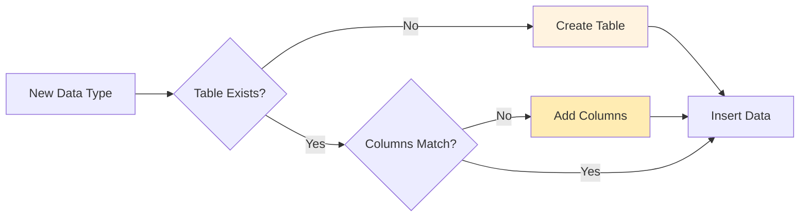
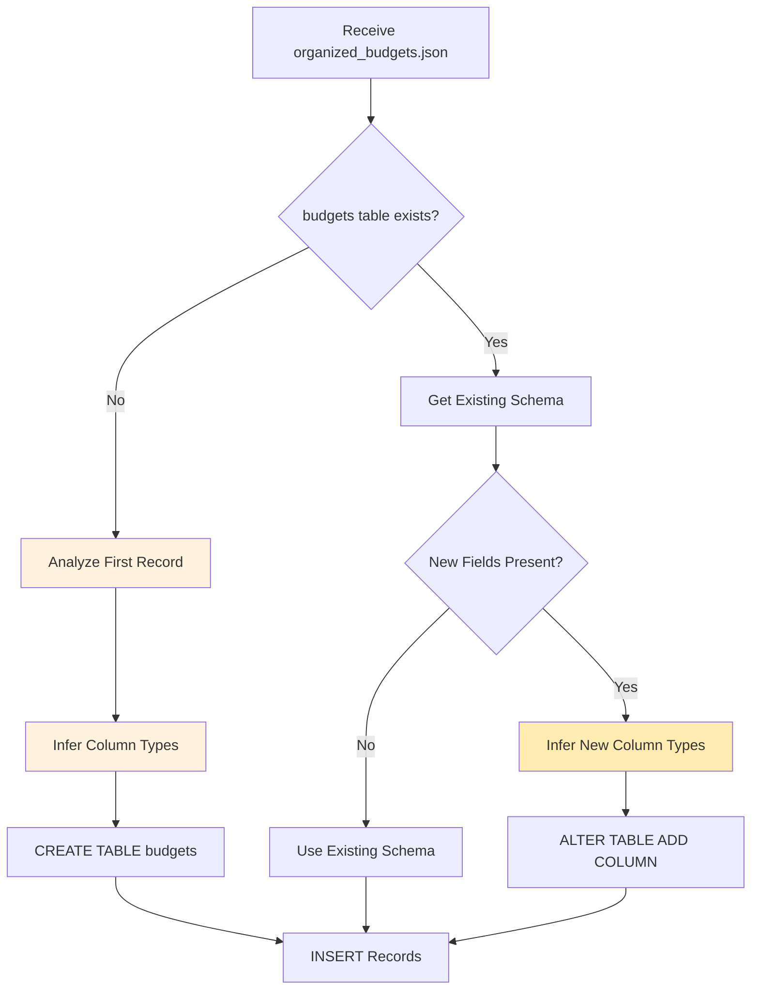

# Database Schema

Finance AI uses SQLite with **dynamic schema evolution**, meaning tables and columns are created automatically based on your data.

## Core Concept

Unlike traditional databases with fixed schemas, Finance AI adapts:



## Database Location

```
data/finance.db
```

**Type:** SQLite3  
**Size:** Grows with your data (~1KB per transaction)

## Default Tables

### transactions

Stores all financial transactions from uploaded files.

**Schema:**

| Column | Type | Description |
|--------|------|-------------|
| `id` | INTEGER | Primary key (auto-increment) |
| `date` | TEXT | Transaction date (YYYY-MM-DD) |
| `amount` | REAL | Amount (negative = expense, positive = income) |
| `description` | TEXT | What the transaction was for |
| `category` | TEXT | Category (e.g., "Groceries", "Dining") |
| `created_at` | TEXT | When record was created (timestamp) |
| `updated_at` | TEXT | Last update timestamp |

**Example Records:**

```sql
sqlite> SELECT * FROM transactions LIMIT 3;

id  date        amount   description              category   created_at           updated_at
--  ----------  -------  ----------------------  ---------  ------------------  ------------------
1   2025-01-15  -45.67   Whole Foods Market #123  Groceries  2025-10-07 15:45:23  2025-10-07 15:45:23
2   2025-01-16  -5.25    Starbucks Coffee Shop    Dining     2025-10-07 15:45:23  2025-10-07 15:45:23
3   2025-01-25  3500.00  Salary Deposit          Income     2025-10-07 15:45:23  2025-10-07 15:45:23
```

**Create Statement:**

```sql
CREATE TABLE IF NOT EXISTS transactions (
    id INTEGER PRIMARY KEY AUTOINCREMENT,
    date TEXT,
    amount REAL,
    description TEXT,
    category TEXT,
    created_at TEXT DEFAULT CURRENT_TIMESTAMP,
    updated_at TEXT DEFAULT CURRENT_TIMESTAMP
);
```

### mem_labels

Stores learned keyword-to-category mappings for improving future categorization.

**Schema:**

| Column | Type | Description |
|--------|------|-------------|
| `id` | INTEGER | Primary key |
| `keyword` | TEXT | Keyword or phrase (e.g., "whole foods") |
| `category` | TEXT | Assigned category (e.g., "Groceries") |
| `created_at` | TEXT | When mapping was created |

**Example Records:**

```sql
sqlite> SELECT * FROM mem_labels;

id  keyword         category    created_at
--  -------------  ----------  ------------------
1   whole foods     Groceries   2025-10-07 16:20:15
2   starbucks       Dining      2025-10-07 16:21:30
3   shell gas       Transport   2025-10-07 16:22:45
4   amazon          Shopping    2025-10-07 16:23:10
```

**Create Statement:**

```sql
CREATE TABLE IF NOT EXISTS mem_labels (
    id INTEGER PRIMARY KEY AUTOINCREMENT,
    keyword TEXT UNIQUE,
    category TEXT,
    created_at TEXT DEFAULT CURRENT_TIMESTAMP
);
```

**Purpose:**

When you manually change a transaction category, the system remembers:

1. User changes "WHOLEFDS #123" from "Uncategorized" to "Groceries"
2. System extracts keyword: "wholefds" or "whole foods"
3. Stores mapping: `whole foods → Groceries`
4. Future transactions with "Whole Foods" auto-categorize to "Groceries"

### documents_metadata (Optional)

If you want to track uploaded files:

**Schema:**

| Column | Type | Description |
|--------|------|-------------|
| `id` | INTEGER | Primary key |
| `filename` | TEXT | Original filename |
| `file_type` | TEXT | Extension (.csv, .pdf, .txt) |
| `file_size` | INTEGER | Size in bytes |
| `upload_date` | TEXT | When file was uploaded |
| `records_extracted` | INTEGER | Number of records extracted |
| `session_id` | TEXT | Processing session ID |

**Example:**

```sql
sqlite> SELECT * FROM documents_metadata;

id  filename           file_type  file_size  upload_date          records_extracted  session_id
--  ----------------  ---------  ---------  -------------------  -----------------  --------------
1   chase_jan.csv      .csv       12543      2025-10-07 15:45:20  42                 20251007_154520
2   amex_jan.pdf       .pdf       234567     2025-10-07 16:10:15  38                 20251007_161015
```

## Dynamic Schema Evolution

### How It Works

When Agent 3 (DatabaseAgent) receives organized data:



### Example: New Table Creation

**Input:** `organized_budgets.json`

```json
{
  "data_type": "budgets",
  "records": [
    {
      "month": "2025-01",
      "category": "Groceries",
      "planned": 500.00,
      "actual": 467.89,
      "remaining": 32.11
    }
  ]
}
```

**Agent 3 Actions:**

1. Check if `budgets` table exists → No
2. Analyze first record → Infer types:
   - `month` (TEXT)
   - `category` (TEXT)
   - `planned` (REAL)
   - `actual` (REAL)
   - `remaining` (REAL)
3. Create table:

```sql
CREATE TABLE budgets (
    id INTEGER PRIMARY KEY AUTOINCREMENT,
    month TEXT,
    category TEXT,
    planned REAL,
    actual REAL,
    remaining REAL,
    created_at TEXT DEFAULT CURRENT_TIMESTAMP,
    updated_at TEXT DEFAULT CURRENT_TIMESTAMP
);
```

4. Insert record

### Example: Schema Extension

**Scenario:** You upload a new budget file with an extra field

**New Input:** `organized_budgets.json`

```json
{
  "data_type": "budgets",
  "records": [
    {
      "month": "2025-02",
      "category": "Groceries",
      "planned": 500.00,
      "actual": 445.23,
      "remaining": 54.77,
      "notes": "Saved by shopping sales"  // NEW FIELD
    }
  ]
}
```

**Agent 3 Actions:**

1. Check if `budgets` table exists → Yes
2. Get existing columns → `[month, category, planned, actual, remaining]`
3. Detect new field → `notes`
4. Infer type → `TEXT`
5. Alter table:

```sql
ALTER TABLE budgets ADD COLUMN notes TEXT;
```

6. Insert record (including new field)

### Type Inference

```python
def infer_sql_type(value):
    if isinstance(value, bool):
        return "INTEGER"  # SQLite uses 0/1 for boolean
    elif isinstance(value, int):
        return "INTEGER"
    elif isinstance(value, float):
        return "REAL"
    elif isinstance(value, (dict, list)):
        return "TEXT"  # Stored as JSON string
    else:
        return "TEXT"  # Default
```

**Type Mappings:**

| Python Type | SQL Type | Example |
|-------------|----------|---------|
| `bool` | INTEGER | `True → 1`, `False → 0` |
| `int` | INTEGER | `42`, `-100` |
| `float` | REAL | `45.67`, `3500.00` |
| `str` | TEXT | `"Groceries"`, `"2025-01-15"` |
| `dict`, `list` | TEXT | Stored as JSON string |
| `None` | NULL | NULL value |

## Querying the Database

### Using SQLite CLI

```bash
# Open database
sqlite3 data/finance.db

# List tables
.tables

# View schema
.schema transactions

# Query transactions
SELECT * FROM transactions WHERE category = 'Groceries';

# Aggregations
SELECT category, SUM(amount) as total 
FROM transactions 
WHERE amount < 0 
GROUP BY category
ORDER BY total;
```

### Using Python

```python
import sqlite3
import pandas as pd

# Connect
conn = sqlite3.connect('data/finance.db')

# Query as DataFrame
df = pd.read_sql_query("SELECT * FROM transactions", conn)

# Aggregations
spending = pd.read_sql_query("""
    SELECT category, SUM(amount) as total
    FROM transactions
    WHERE amount < 0
    GROUP BY category
    ORDER BY total
""", conn)

conn.close()
```

### Common Queries

**Monthly Spending:**

```sql
SELECT 
    strftime('%Y-%m', date) as month,
    SUM(CASE WHEN amount < 0 THEN amount ELSE 0 END) as spending,
    SUM(CASE WHEN amount > 0 THEN amount ELSE 0 END) as income
FROM transactions
GROUP BY month
ORDER BY month DESC;
```

**Category Breakdown:**

```sql
SELECT 
    category,
    COUNT(*) as transaction_count,
    SUM(amount) as total_amount,
    AVG(amount) as avg_amount
FROM transactions
WHERE amount < 0
GROUP BY category
ORDER BY total_amount;
```

**Recent Transactions:**

```sql
SELECT date, description, amount, category
FROM transactions
ORDER BY date DESC, created_at DESC
LIMIT 20;
```

**Largest Expenses:**

```sql
SELECT date, description, amount, category
FROM transactions
WHERE amount < 0
ORDER BY amount
LIMIT 10;
```

## Database Maintenance

### Backup

```bash
# Create backup
sqlite3 data/finance.db ".backup data/finance_backup.db"

# Or simple copy
cp data/finance.db data/finance_backup_$(date +%Y%m%d).db
```

### Vacuum (Optimize)

```sql
-- Reclaim unused space
VACUUM;

-- Analyze for query optimization
ANALYZE;
```

### Reset Database

```bash
# ⚠️ WARNING: This deletes all data!

# Option 1: Delete file
rm data/finance.db

# Option 2: Drop tables
sqlite3 data/finance.db "DROP TABLE IF EXISTS transactions; DROP TABLE IF EXISTS mem_labels;"
```

## Indexes for Performance

As your database grows, add indexes:

```sql
-- Index on date for faster date range queries
CREATE INDEX idx_transactions_date ON transactions(date);

-- Index on category for faster filtering
CREATE INDEX idx_transactions_category ON transactions(category);

-- Composite index for common query patterns
CREATE INDEX idx_transactions_date_category ON transactions(date, category);
```

**When to Add Indexes:**

- ✅ When you have >10,000 transactions
- ✅ If queries feel slow
- ✅ On frequently filtered columns

**Trade-off:**
- ✅ Faster SELECT queries
- ❌ Slightly slower INSERT (minimal impact)

## Schema Migrations

If you need to change the schema manually:

### Add Column

```sql
ALTER TABLE transactions ADD COLUMN account TEXT;
```

### Rename Table

```sql
ALTER TABLE transactions RENAME TO transactions_old;
CREATE TABLE transactions (...);
INSERT INTO transactions SELECT ... FROM transactions_old;
DROP TABLE transactions_old;
```

### Change Column Type

SQLite doesn't support ALTER COLUMN, so use this pattern:

```sql
-- 1. Create new table with correct schema
CREATE TABLE transactions_new (
    id INTEGER PRIMARY KEY,
    date TEXT,
    amount REAL,  -- Changed from INTEGER to REAL
    ...
);

-- 2. Copy data
INSERT INTO transactions_new SELECT * FROM transactions;

-- 3. Drop old table
DROP TABLE transactions;

-- 4. Rename new table
ALTER TABLE transactions_new RENAME TO transactions;
```

## Advanced Features

### JSON Columns

Store complex data as JSON:

```sql
-- Store metadata as JSON
CREATE TABLE transactions (
    ...
    metadata TEXT  -- Stores JSON string
);

-- Insert with JSON
INSERT INTO transactions (date, amount, metadata)
VALUES ('2025-01-15', -45.67, '{"store_id": "123", "cashier": "Alice"}');

-- Query JSON (SQLite 3.38+)
SELECT json_extract(metadata, '$.store_id') FROM transactions;
```

### Triggers

Auto-update `updated_at` timestamp:

```sql
CREATE TRIGGER update_timestamp
AFTER UPDATE ON transactions
FOR EACH ROW
BEGIN
    UPDATE transactions SET updated_at = CURRENT_TIMESTAMP
    WHERE id = NEW.id;
END;
```

### Views

Create virtual tables for common queries:

```sql
CREATE VIEW monthly_summary AS
SELECT 
    strftime('%Y-%m', date) as month,
    category,
    SUM(amount) as total
FROM transactions
GROUP BY month, category;

-- Query the view
SELECT * FROM monthly_summary WHERE month = '2025-01';
```

## Database Limits

| Limit | Value |
|-------|-------|
| **Max database size** | 281 TB (practical: disk space) |
| **Max row size** | 1 GB |
| **Max column count** | 2000 columns per table |
| **Max table count** | Unlimited (practical: thousands) |

For reference: 1 million transactions ≈ 100-200 MB

## Troubleshooting

### Database Locked

**Error:** `database is locked`

**Cause:** Multiple processes accessing simultaneously

**Solution:**
```python
# Increase timeout
conn = sqlite3.connect('data/finance.db', timeout=20.0)
```

### Corrupt Database

**Check integrity:**
```sql
PRAGMA integrity_check;
```

**If corrupted, restore from backup:**
```bash
cp data/finance_backup.db data/finance.db
```

### Slow Queries

**Check query plan:**
```sql
EXPLAIN QUERY PLAN
SELECT * FROM transactions WHERE date > '2025-01-01';
```

**Add indexes if needed** (see Indexes section above)

## Next Steps

- [Agent Workflow](../agent-workflow.md) - How data gets into the database
- [LLM Integration](../llm-integration.md) - AI-powered data extraction
- [API Reference](../api-reference.md) - Python API for database operations

---

!!! info "Dynamic Schema"
    Remember: The schema adapts to your data. You rarely need to manually create tables!
