# Frequently Asked Questions (FAQ)

Common questions about Finance AI Dashboard.

## General

### What is Finance AI Dashboard?

Finance AI Dashboard is an **offline personal finance manager** that uses local AI to automatically parse, categorize, and visualize your financial transactions from bank statements, credit card statements, and other financial documents.

**Key Features:**
- 🤖 AI-powered document understanding
- 🔒 100% offline and private
- 📊 Automatic categorization
- 📈 Interactive visualizations
- 💾 Dynamic database schema

### Is my financial data safe?

**Yes - 100% safe and private!**

Your data **never leaves your computer:**
- ✅ All processing happens locally
- ✅ No internet connection required
- ✅ No cloud uploads
- ✅ No external API calls
- ✅ Open source code (you can audit it)

```mermaid
graph LR
    A[Your Files] --> B[Your Computer]
    B --> C[Local AI]
    C --> D[Local Database]
    
    B -.->|Never| E[❌ Internet]
    
    style E fill:#ffcdd2
```



### Do I need an internet connection?

**No!** Finance AI works completely offline after initial setup.

**Internet only needed for:**
- Downloading the AI model (one-time, 4.7GB)
- Installing dependencies (one-time)

**After setup:**
- ✅ Process files offline
- ✅ View dashboard offline
- ✅ Everything works offline

### Is it free?

**Yes!** Finance AI is completely free and open source.

- ✅ No subscription fees
- ✅ No hidden costs
- ✅ No "premium" features
- ✅ MIT License (use freely)

### What makes this "AI-first"?

Unlike traditional finance apps that use keyword matching:

**Traditional Apps:**
```
IF description contains "Whole Foods" THEN category = "Groceries"
```

**Finance AI:**
```
AI understands: "WHOLEFDS #123" → Whole Foods → Grocery store → Groceries
```

The AI **understands context**, not just keywords!

---

## Installation & Setup

### What are the system requirements?

**Minimum:**
- Python 3.10+
- 6GB RAM
- 5GB free disk space
- macOS, Linux, or Windows

**Recommended:**
- Python 3.11+
- 8GB+ RAM
- SSD storage
- 4+ CPU cores

### How long does installation take?

**Time Breakdown:**

| Step | Duration |
|------|----------|
| Download AI model | 5-10 min (4.7GB) |
| Install dependencies | 2-5 min |
| First app startup | 5-10 sec |
| **Total** | **~15 minutes** |

**Subsequent startups:** 2-5 seconds

### Can I use a different AI model?

**Yes!** You can use any GGUF-format model.

**Popular alternatives:**

| Model | Size | Speed | Quality |
|-------|------|-------|---------|
| TinyLlama-1.1B | 600MB | Fast | Basic |
| Mistral-7B (default) | 4.7GB | Medium | Good |
| Llama-2-13B | 13GB | Slow | Best |

**How to switch:**

Edit `llm_handler.py`:
```python
model_path = Path("your-model-name.gguf")
```

See: [LLM Integration Guide](llm-integration.md)

### Do I need a GPU?

**No!** Finance AI works fine on CPU.

**Performance:**

| Hardware | Processing Time |
|----------|----------------|
| CPU only | 2-5 seconds |
| M1/M2 Mac (Metal) | 1-2 seconds |
| NVIDIA GPU | 1-2 seconds |

**GPU support (optional):**
- macOS: Metal (M1/M2)
- Linux: CUDA (NVIDIA)
- Windows: CUDA (NVIDIA)

---

## Using the Dashboard

### What file formats are supported?

**Fully Supported:**
- ✅ CSV (.csv)
- ✅ PDF (.pdf)
- ✅ Text (.txt, .text)

**Coming Soon:**
- 🔄 Excel (.xlsx, .xls)
- 🔄 OFX (.ofx)
- 🔄 QIF (.qif)

### Can I upload bank statements directly?

**Yes!** The AI can read:

- Bank account statements (PDF or CSV)
- Credit card statements (PDF or CSV)
- Investment statements
- Invoices and receipts
- Any financial document

**Supported banks:** All banks! The AI adapts to any format.

### How accurate is the categorization?

**Typical accuracy:**
- First upload: 70-80% accurate
- After training: 90-95% accurate

**Improves over time:**
1. You upload transactions
2. AI guesses categories (70-80% right)
3. You correct wrong ones
4. AI learns from corrections
5. Next upload is more accurate!

### Can I edit transactions?

**Yes!** Click any transaction to:

- ✏️ Change category
- ✏️ Edit description
- ✏️ Update amount
- ✏️ Change date

**The AI learns from your edits!**

### How do I add custom categories?

**Option 1: Edit app.py**

```python
categories = [
    'Groceries', 'Dining', 'Transport',
    'Your Custom Category',  # Add here
    'Another Category'
]
```

**Option 2: Let AI create them**

Upload a file with new categories in the data:
```csv
Date,Description,Amount,Category
2025-01-15,Dog Food,-45.67,Pet Care
```

The AI will recognize "Pet Care" and use it going forward!

### Can I track multiple accounts?

**Yes!** Upload statements from different accounts:

```
✓ chase_checking.csv: 42 records
✓ chase_savings.csv: 12 records
✓ amex_credit.pdf: 38 records
```

All transactions combine in one dashboard.

**To separate accounts:**

Add an "account" column in your CSV:
```csv
Date,Description,Amount,Account
2025-01-15,Groceries,-45.67,Checking
2025-01-16,Savings deposit,500.00,Savings
```

### How do I export my data?

**Method 1: SQLite Database**

```bash
# Copy database file
cp data/finance.db my_finance_backup.db
```

**Method 2: Export to CSV**

```bash
sqlite3 data/finance.db

# Export all transactions
.mode csv
.output transactions_export.csv
SELECT * FROM transactions;
.quit
```

**Method 3: Python Script**

```python
import sqlite3
import pandas as pd

conn = sqlite3.connect('data/finance.db')
df = pd.read_sql_query("SELECT * FROM transactions", conn)
df.to_csv('export.csv', index=False)
```

---

## Technical Questions

### How does the AI work?

**Three-Agent System:**


1. **Agent 1 (Extractor):** Reads file and extracts raw data
2. **Agent 2 (Organizer):** Structures data into transactions
3. **Agent 3 (Database):** Creates/updates database schema and stores records

See: [AI Architecture](ai-architecture.md) | [Agent Workflow](agent-workflow.md)

### What is dynamic schema evolution?

The database **adapts to your data automatically**.

**Traditional Database:**
```
❌ Must define schema first
❌ ALTER TABLE manually for new fields
❌ Rigid structure
```

**Finance AI:**
```
✅ Tables created on-demand
✅ Columns added automatically
✅ Flexible structure
```

**Example:**

Upload a budget file → `budgets` table created automatically!
```json
{"month": "2025-01", "category": "Groceries", "planned": 500}
```
↓
```sql
CREATE TABLE budgets (month TEXT, category TEXT, planned REAL);
```

See: [Database Schema](database-schema.md)

### Where is data stored?

**Location:** `data/finance.db`

**Format:** SQLite database

**Tables:**
- `transactions` - Financial transactions
- `mem_labels` - Learned categorization rules
- _Dynamic tables_ - Created based on uploaded data

**Size:** ~100KB per 1,000 transactions

### Can I use this for business expenses?

**Yes!** Finance AI works for:

- ✅ Personal finances
- ✅ Freelance expenses
- ✅ Small business accounting
- ✅ Project budgeting

**Multi-entity tracking:**

Add columns for business/project:
```csv
Date,Description,Amount,Category,Business
2025-01-15,Office supplies,-45.67,Supplies,Acme Corp
2025-01-16,Client lunch,-85.00,Dining,Acme Corp
```

### Can I run this on a server?

**Yes, but...**

Finance AI is designed for **local use**. However, you can:

**Option 1: Personal Server**
```bash
# Run on your home server
python -m finance_ai --host=0.0.0.0 --port=8050

# Access from other devices on your network
http://your-server-ip:8050
```

**Option 2: Cloud Server (Not Recommended)**
- ⚠️ Less private (data on cloud)
- ⚠️ Requires strong authentication
- ⚠️ Network latency

### Is there a mobile app?

**Not yet!** But you can:

**Option 1: Mobile Browser**
```
Open http://your-computer-ip:8050 in mobile browser
```

**Option 2: Export Data**
```
Export to CSV and use mobile spreadsheet app
```

**Future Plans:**
- 📱 Native mobile app
- 🔄 Mobile-optimized web interface

---

## Troubleshooting

### Why is processing slow?

**Common causes:**

1. **First upload:** Model loads (5-10 sec) - normal!
2. **Large file:** >10MB takes longer
3. **Low RAM:** Close other apps
4. **CPU threads:** Adjust in `llm_handler.py`

See: [Troubleshooting: Slow Processing](troubleshooting.md#slow-processing)

### Why aren't my transactions showing?

**Check:**

1. ✅ Date range filter (expand to "All Time")
2. ✅ Category filters (check all categories)
3. ✅ Database query: `sqlite3 data/finance.db "SELECT COUNT(*) FROM transactions;"`

See: [Troubleshooting: Transactions Not Appearing](troubleshooting.md#transactions-not-appearing)

### The categories are wrong!

**This is normal!** The AI learns over time.

**Fix:**
1. Click transaction
2. Change category
3. AI remembers for next time

**After 3-5 uploads:** Accuracy improves to 90-95%!

### Can I reset everything?

**Yes!** To start fresh:

```bash
# ⚠️ Backup first!
cp data/finance.db data/backup.db

# Delete database
rm data/finance.db

# Restart app (creates new database)
python -m finance_ai
```

---

## Advanced Usage

### Can I automate uploads?

**Yes!** Use Python scripting:

```python
from finance_ai.agents import AgentWorkflow

workflow = AgentWorkflow()

# Process multiple files
files = ['jan.csv', 'feb.csv', 'mar.csv']
for file in files:
    result = workflow.process_file(file, file)
    print(f"{file}: {result['records']} records")
```

**Scheduled uploads:**

```bash
# Cron job (Linux/Mac) - daily at 8am
0 8 * * * cd /path/to/finance-ai && .venv/bin/python batch_upload.py
```

### Can I query data with Python?

**Yes!** Use pandas:

```python
import sqlite3
import pandas as pd

# Connect to database
conn = sqlite3.connect('data/finance.db')

# Query transactions
df = pd.read_sql_query("""
    SELECT * FROM transactions 
    WHERE date >= '2025-01-01'
""", conn)

# Analyze
spending = df[df['amount'] < 0].groupby('category')['amount'].sum()
print(spending)
```

### Can I customize the dashboard?

**Yes!** Edit `finance_ai/app.py` to:

- Change colors/theme
- Add new charts
- Modify layout
- Add custom filters

**Example: Add a new chart**

```python
# In finance_ai/app.py, add to layout
dcc.Graph(
    id='my-custom-chart',
    figure=px.line(df, x='date', y='balance')
)
```

### Can I integrate with other tools?

**Yes!** Export data to:

**CSV/Excel:**
```python
df.to_csv('export.csv')
df.to_excel('export.xlsx')
```

**JSON API:**
```python
# Create a REST API endpoint
@app.route('/api/transactions')
def get_transactions():
    conn = sqlite3.connect('data/finance.db')
    df = pd.read_sql_query("SELECT * FROM transactions", conn)
    return df.to_json()
```

**Power BI / Tableau:**

Import `data/finance.db` directly (SQLite connector)

---

## Contributing

### How can I contribute?

We welcome contributions!

**Ways to help:**
- 🐛 Report bugs
- 💡 Suggest features
- 📖 Improve documentation
- 🧑‍💻 Submit code (PRs welcome!)
- ⭐ Star the repo

See: [Contributing Guide](contributing.md)

### Can I add my own agents?

**Yes!** The agent system is extensible.

**Example: Create a Budget Agent**

```python
# In agents.py
class BudgetAgent:
    def __init__(self, llm_handler):
        self.llm = llm_handler
    
    def analyze_spending(self, month):
        # Use LLM to analyze spending patterns
        pass

# Add to workflow
workflow.budget_agent = BudgetAgent(llm)
```

### Where can I get help?

- 📖 Read the [Documentation](index.md)
- 🐛 Check [Troubleshooting Guide](troubleshooting.md)
- 💬 Ask in GitHub Discussions
- 🐛 Open an issue on GitHub

---

## Future Features

### What's coming next?

**Roadmap:**

**v2.0 (Q1 2025):**
- 📱 Mobile-responsive UI
- 💰 Budget tracking
- 📊 Advanced reports
- 🔄 Recurring transaction detection

**v3.0 (Q2 2025):**
- 🤖 AI-powered insights and recommendations
- 📈 Investment tracking
- 🌍 Multi-currency support
- 🔗 Bank sync (optional)

See: [Full Roadmap](roadmap.md)

### Can I request features?

**Yes!** Open a GitHub issue:

1. Go to GitHub repository
2. Click "Issues" → "New Issue"
3. Describe your feature request
4. We'll review and discuss!

---

## Comparison

### How is this different from Mint/YNAB/Personal Capital?

| Feature | Finance AI | Mint/YNAB | Personal Capital |
|---------|-----------|-----------|------------------|
| **Privacy** | 100% offline | Cloud-based | Cloud-based |
| **Cost** | Free | $15/mo | Free (ads) |
| **AI-Powered** | ✅ Yes | ❌ No | ❌ No |
| **Custom Categories** | ✅ Unlimited | ❌ Limited | ❌ Limited |
| **File Formats** | Any | CSV only | API only |
| **Bank Sync** | Manual | Automatic | Automatic |
| **Self-Hosted** | ✅ Yes | ❌ No | ❌ No |

**Finance AI is for you if:**
- 🔒 Privacy is important
- 🤖 Want AI understanding
- 💰 Don't want subscriptions
- 🛠️ Like control & customization

**Other tools are better if:**
- 🔄 Need automatic bank sync
- 📱 Require mobile app
- 💼 Want managed service

---

!!! question "Still have questions?"
    - Check the [Troubleshooting Guide](troubleshooting.md)
    - Read the [Documentation](index.md)
    - Ask in GitHub Discussions
    - Open an issue
