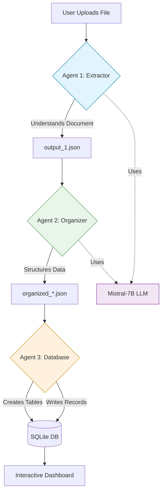

# Welcome to Finance AI Dashboard

<div align="center">

🤖 **AI-Powered Personal Finance Management**

100% Offline | Privacy-First | Self-Adapting

[Get Started](getting-started.md){ .md-button .md-button--primary }
[View on GitHub](https://github.com/PhilipNJ/finance-ai){ .md-button }

</div>

---

## What is Finance AI Dashboard?

Finance AI Dashboard is an intelligent personal finance management system that uses **local AI agents** to automatically extract, organize, and analyze your financial data from any document format.

Unlike traditional finance software, Finance AI is built with an **AI-first philosophy** - the AI agents are not a feature, they ARE the product.

## Key Features

:robot: **Multi-Agent AI System**
:   Three specialized AI agents work together to process your financial documents intelligently.

:file_folder: **Universal File Support**
:   Upload CSV, PDF, text files, or even handwritten receipts (with OCR support).

:brain: **Context-Aware Processing**
:   The LLM understands your documents contextually, not just through pattern matching.

:recycle: **Dynamic Database Schema**
:   Database tables and columns are created automatically based on your data.

:chart_with_upwards_trend: **Interactive Dashboard**
:   Beautiful visualizations of spending patterns, monthly cashflow, and category breakdowns.

:lock: **100% Offline & Private**
:   Everything runs locally - no cloud APIs, no data leaving your machine.

## How It Works



### The Three Agents

**Agent 1: Extractor** 🔍
:   Reads any document format and uses the LLM to understand context, extract financial entities, and identify document types.

**Agent 2: Organizer** 📊
:   Takes extracted data and intelligently organizes it into structured formats (transactions, budgets, accounts, etc.).

**Agent 3: Database Expert** 💾
:   Analyzes organized data, creates necessary database tables and columns dynamically, then writes everything to SQLite.

[Learn more about the AI architecture →](ai-architecture.md)

## Quick Example

```python
# User uploads "statement.pdf"
# Agent 1: Understands it's a bank statement
# Agent 2: Extracts 42 transactions
# Agent 3: Writes to database, creates 2 new categories

Result: ✓ statement.pdf: 42 records processed 🤖
```

## Why AI-First?

Traditional finance software uses rigid rules and pattern matching. Finance AI uses **local language models** to truly understand your documents:

| Traditional Approach | AI-First Approach |
|---------------------|-------------------|
| Fixed CSV parsers | Understands any format |
| Keyword matching | Context understanding |
| Manual categorization | Intelligent classification |
| Static database schema | Self-evolving schema |
| Structured data only | Structured + unstructured |

## Privacy & Security

!!! success "Your Data Stays Private"
    - ✅ **100% Offline** - No external API calls
    - ✅ **Local Processing** - Everything runs on your machine
    - ✅ **No Telemetry** - Zero tracking or analytics
    - ✅ **Open Source** - Audit the code yourself

## Technology Stack

The application is built on:

- **AI Engine**: Mistral-7B-Instruct (Q5_0 quantized, ~4.7GB)
- **LLM Runtime**: llama-cpp-python for efficient CPU/GPU inference
- **Framework**: Python Dash with Plotly visualizations
- **Database**: SQLite with dynamic schema evolution
- **Parsing**: pandas, pdfplumber, pytesseract (OCR)

## System Requirements

| Requirement | Minimum | Recommended |
|-------------|---------|-------------|
| **Python** | 3.10+ | 3.11+ |
| **RAM** | 8GB | 16GB |
| **Storage** | 5GB | 10GB |
| **CPU** | 4 cores | 8+ cores |

## Next Steps

<div class="grid cards" markdown>

-   :material-rocket-launch: **Get Started**

    ---

    Install and run Finance AI in minutes

    [:octicons-arrow-right-24: Installation Guide](getting-started.md)

-   :material-robot: **Learn the Architecture**

    ---

    Understand how the AI agents work

    [:octicons-arrow-right-24: AI Architecture](ai-architecture.md)

-   :material-book-open-page-variant: **User Guide**

    ---

    Learn how to use all features

    [:octicons-arrow-right-24: User Guide](user-guide/uploading.md)

-   :material-api: **API Reference**

    ---

    Technical documentation for developers

    [:octicons-arrow-right-24: API Docs](api-reference.md)

</div>

## Community

- **Issues**: [GitHub Issues](https://github.com/PhilipNJ/finance-ai/issues)
- **Discussions**: [GitHub Discussions](https://github.com/PhilipNJ/finance-ai/discussions)
- **Contributing**: [Contribution Guidelines](contributing.md)

---

!!! tip "Quick Tip"
    Run `python3 preflight_check.py` before starting to verify all dependencies are installed correctly.
