# Quick Start Tutorial

Get up and running with Finance AI Dashboard in 5 minutes.

## Prerequisites

- ✅ Python 3.10 or newer
- ✅ 6GB free RAM (for the AI model)
- ✅ 5GB free disk space
- ✅ Basic terminal/command line knowledge

## Installation

### Option 1: Automated (Recommended)

=== "macOS / Linux"
    ```bash
    # Clone or download the project
    cd finance-ai
    
    # Run the installation script
    python3 preflight_check.py
    
    # If successful, the app will start automatically!
    ```

=== "Windows"
    ```cmd
    # Clone or download the project
    cd finance-ai
    
    # Run the installation script
    python preflight_check.py
    
    # If successful, the app will start automatically!
    ```

### Option 2: Manual

```bash
# 1. Create virtual environment
python3 -m venv .venv

# 2. Activate it
source .venv/bin/activate  # macOS/Linux
# OR
.venv\Scripts\activate  # Windows

# 3. Install dependencies
pip install --upgrade pip
pip install -r requirements.txt

# 4. Start the app
python app.py
```

## First Launch

When you run the app for the first time:

```bash
python app.py
```

You'll see:

```
🤖 Finance AI Dashboard - Starting...
📦 Checking LLM model...
✓ Model found: mistral-7b-instruct-v0.1.Q5_0.gguf (4.7 GB)
🧠 Loading AI model... (this may take 5-10 seconds)
✓ LLM loaded successfully!
🌐 Dashboard running at: http://127.0.0.1:8050

Press Ctrl+C to stop.
```

!!! success "First Load"
    The first time takes 5-10 seconds to load the AI model. Subsequent starts are faster (~2 seconds).

## Your First Upload

### 1. Open the Dashboard

Navigate to http://127.0.0.1:8050 in your browser:


### 2. Prepare a File

You can upload:

- **CSV files** - Bank exports, credit card statements
- **PDF files** - Bank statements, invoices, receipts
- **Text files** - Any financial document

!!! example "Example CSV"
    Create a test file called `test_transactions.csv`:
    
    ```csv
    Date,Description,Amount
    2025-01-15,Whole Foods Market,45.67
    2025-01-16,Coffee Shop,5.25
    2025-01-20,Gas Station,52.00
    2025-01-22,Amazon Purchase,28.99
    2025-01-25,Salary,3500.00
    ```

### 3. Upload the File

1. Click the **Upload Area** or drag & drop your file
2. Wait for the AI to process (2-5 seconds)
3. See the success message: ✓ test_transactions.csv: 5 records processed 🤖


### 4. View Your Data

Scroll down to see:

- **Date Range Selector** - Filter by time period
- **Category Filter** - Show/hide categories
- **Transaction Table** - All your transactions
- **Spending Chart** - Visual breakdown by category


## Understanding the AI Processing

Here's what happens when you upload:

```mermaid
sequenceDiagram
    participant You
    participant Dashboard
    participant AI
    participant Database
    
    You->>Dashboard: Upload file
    Dashboard->>AI: Process file
    Note over AI: Agent 1: Extract data
    Note over AI: Agent 2: Organize by type
    Note over AI: Agent 3: Write to database
    AI->>Database: Store transactions
    Database->>Dashboard: Success
    Dashboard->>You: ✓ Records processed 🤖
```



### What the AI Does:

1. **Reads** your file (CSV, PDF, or text)
2. **Understands** the structure and content
3. **Extracts** financial data (dates, amounts, descriptions)
4. **Categorizes** transactions automatically
5. **Stores** everything in the database

!!! info "AI-Powered"
    The AI can understand almost any format - even handwritten receipts (with OCR)!

## Exploring Your Data

### Filter by Date

Use the date range selector to focus on specific time periods:

```
[Jan 1, 2025] ───────────────────── [Jan 31, 2025]
```

### Filter by Category

Toggle categories on/off to see specific spending areas:

- ✅ Groceries
- ✅ Dining
- ✅ Transport
- ❌ Entertainment (hidden)

### Edit Transactions

Click on any transaction to:

- Change the category
- Edit the description
- Update the amount

The AI learns from your edits to improve future categorization!

## Common File Formats

### Bank Statements (CSV)

Most banks let you export transactions as CSV:

**Chase Bank:**
```csv
Details,Posting Date,Description,Amount,Type,Balance,Check or Slip #
DEBIT,01/15/2025,"WHOLE FOODS MARKET #123",-45.67,Sale,2500.33,
```

**Bank of America:**
```csv
Date,Description,Amount
01/15/2025,WHOLEFDS #123,-45.67
```

Finance AI understands both formats automatically! 🎉

### Credit Card Statements (PDF)

Upload PDF statements directly - the AI will extract transactions:

```
CHASE CREDIT CARD STATEMENT
Statement Period: 01/01/2025 - 01/31/2025

Date       Description              Amount
01/15      WHOLE FOODS MARKET       $45.67
01/16      STARBUCKS #12345          $5.25
```

### Text Input

Even paste raw text:

```
Spent $45.67 at Whole Foods on January 15th
Coffee was $5.25 at Starbucks yesterday
Got gas for $52.00 last week
```

The AI will figure it out! 🧠

## Tips & Tricks

### 1. Upload Multiple Files

Upload all your statements at once:

```
✓ chase_jan.csv: 42 records processed
✓ amex_jan.pdf: 38 records processed  
✓ cash_receipts.txt: 12 records processed
```

Total: 92 transactions in ~10 seconds!

### 2. Train the AI

Edit categories when they're wrong:

1. Click transaction → Change category to "Groceries"
2. AI remembers: "Whole Foods" = Groceries
3. Future uploads automatically categorize correctly

### 3. Mixed Formats

Don't worry about format consistency - upload any mix:

- ✅ CSV + PDF + Text
- ✅ Different banks
- ✅ Different layouts

The AI adapts! 🎯

## Troubleshooting

### ❌ "LLM model not found"

**Solution:** Download the model:

```bash
wget https://huggingface.co/TheBloke/Mistral-7B-Instruct-v0.1-GGUF/resolve/main/mistral-7b-instruct-v0.1.Q5_0.gguf
```

Place in project root directory.

### ❌ "Module 'llama_cpp' not found"

**Solution:** Install llama-cpp-python:

=== "macOS (Metal GPU)"
    ```bash
    CMAKE_ARGS="-DLLAMA_METAL=on" pip install llama-cpp-python
    ```

=== "Linux"
    ```bash
    pip install llama-cpp-python
    ```

=== "Windows"
    ```bash
    pip install llama-cpp-python --extra-index-url https://abetlen.github.io/llama-cpp-python/whl/cpu
    ```

### ❌ "Processing failed"

**Check:**

1. File is not corrupted
2. File contains financial data
3. LLM is loaded (check startup logs)

**Still stuck?** See [Troubleshooting Guide](troubleshooting.md)

## Next Steps

Now that you're up and running:

- 📘 [User Guide](user-guide/uploading.md) - Learn all features
- 🏗️ [AI Architecture](ai-architecture.md) - How the AI works
- 🛠️ [Database Schema](database-schema.md) - Data structure
- 🤖 [LLM Integration](llm-integration.md) - Customize the AI

## Video Walkthrough

!!! info "Coming Soon"
    We're creating video tutorials. For now, follow this guide!

---

!!! success "You're All Set!"
    You've successfully set up Finance AI Dashboard and processed your first transactions. Happy analyzing! 📊

!!! question "Need Help?"
    - Check the [FAQ](faq.md)
    - Read the [Troubleshooting Guide](troubleshooting.md)
    - Open an issue on GitHub
