# Uploading Files

Learn how to upload and process financial documents with Finance AI Dashboard.

## Supported File Formats

Finance AI supports three main file types:

| Format | Extensions | Use Case |
|--------|-----------|----------|
| **CSV** | `.csv` | Bank exports, spreadsheets |
| **PDF** | `.pdf` | Bank statements, invoices, receipts |
| **Text** | `.txt`, `.text` | Manual entry, notes, pasted data |

!!! success "Universal Support"
    The AI can understand almost any layout or format within these file types!

## Upload Methods

### Method 1: Drag & Drop


1. Select your file in file explorer
2. Drag it over the upload area (it will highlight)
3. Drop to start processing

### Method 2: Click to Browse

1. Click anywhere in the **Upload Area**
2. File picker opens
3. Select your file
4. Processing starts automatically

### Method 3: Multiple Files

Upload multiple files at once:

1. Select multiple files (Ctrl+Click or Cmd+Click)
2. Drag & drop or use file picker
3. Files process sequentially

```
Processing: chase_jan.csv... ✓ 42 records
Processing: amex_jan.pdf... ✓ 38 records
Processing: receipts.txt... ✓ 12 records

Total: 92 records processed 🤖
```

## CSV Files

### Format Requirements

CSV files should have financial data in columns. The AI understands various formats:

**Standard Format:**
```csv
Date,Description,Amount
2025-01-15,Whole Foods Market,-45.67
2025-01-16,Coffee Shop,-5.25
2025-01-20,Salary,3500.00
```

**Bank Format:**
```csv
Transaction Date,Posted Date,Merchant Name,Amount,Category
01/15/2025,01/16/2025,WHOLEFDS #123,-45.67,Groceries
```

**Custom Format:**
```csv
When,What,How Much
Jan 15,Whole Foods,$45.67
Jan 16,Starbucks,$5.25
```

!!! tip "Flexible Columns"
    The AI doesn't require specific column names - it understands the *meaning* of the data!

### Common CSV Sources

#### Chase Bank

Export from Chase.com:

1. Log in to Chase Online Banking
2. Navigate to Statements & Documents
3. Select "Download transactions"
4. Choose "CSV" format
5. Upload to Finance AI

**Expected columns:**
```csv
Details,Posting Date,Description,Amount,Type,Balance
```

#### Bank of America

Export from BankofAmerica.com:

1. Log in to Online Banking
2. Click "Download transactions"
3. Select CSV/Excel format
4. Upload to Finance AI

**Expected columns:**
```csv
Date,Description,Amount,Running Bal.
```

#### American Express

Export from Amex.com:

1. Go to Statements & Activity
2. Click "Download"
3. Select CSV format
4. Upload to Finance AI

**Expected columns:**
```csv
Date,Description,Amount
```

### Handling Encoding Issues

If you see garbled text (like `é` instead of `é`):

**Option 1: Re-save with UTF-8**

1. Open CSV in Excel/Numbers
2. File → Save As
3. Set encoding to "UTF-8"
4. Upload new file

**Option 2: Use Google Sheets**

1. Upload CSV to Google Sheets
2. File → Download → CSV
3. Google Sheets auto-converts to UTF-8

## PDF Files

### What Works

Finance AI can extract transactions from:

- ✅ Bank statements
- ✅ Credit card statements
- ✅ Invoices
- ✅ Receipts
- ✅ Financial reports
- ✅ Even scanned/image PDFs (with OCR)

### PDF Processing Flow


### Example: Bank Statement

**Typical Statement:**

```
CHASE BANK
Account: ****1234
Statement Period: 01/01/2025 - 01/31/2025

TRANSACTIONS:
Date       Description              Amount
01/15      WHOLE FOODS MARKET       $45.67
01/16      STARBUCKS #12345          $5.25
01/20      SHELL GAS STATION        $52.00
01/22      AMAZON.COM               $28.99
01/25      PAYROLL DEPOSIT        $3,500.00

SUMMARY:
Beginning Balance: $2,000.00
Total Credits: $3,500.00
Total Debits: -$131.91
Ending Balance: $5,368.09
```

The AI extracts:
- 5 transactions
- Proper categorization
- Date normalization
- Amount parsing (handles $ and commas)

### Scanned PDFs & OCR

If your PDF is a scanned image, Finance AI can still read it!

**Requirements:**

1. Install Tesseract OCR (optional but recommended)

=== "macOS"
    ```bash
    brew install tesseract
    ```

=== "Linux"
    ```bash
    sudo apt-get install tesseract-ocr
    ```

=== "Windows"
    Download from: https://github.com/UB-Mannheim/tesseract/wiki

2. Upload the scanned PDF
3. OCR runs automatically if text extraction fails

!!! warning "OCR Accuracy"
    OCR works best with:
    - High-resolution scans (300+ DPI)
    - Clear, readable text
    - Proper orientation (not rotated)

### PDF Best Practices

✅ **Do:**
- Use original PDFs (not re-scanned)
- Keep file size reasonable (<50MB)
- Ensure text is selectable (if possible)

❌ **Don't:**
- Upload password-protected PDFs
- Use extremely low-quality scans
- Rotate documents before uploading (AI can handle rotation)

## Text Files

### Plain Text Input

Simply paste or type financial data:

```
Spent $45.67 at Whole Foods on January 15th
Coffee was $5.25 at Starbucks yesterday  
Got gas for $52.00 last week
Salary deposited: $3,500
```

The AI will:
1. Parse dates (relative like "yesterday" or absolute)
2. Extract amounts (handles $ and various formats)
3. Identify merchants
4. Guess categories

### Structured Text

You can also use basic structure:

```
Transactions for January 2025:

Jan 15 - Whole Foods - $45.67 (groceries)
Jan 16 - Starbucks - $5.25 (coffee)
Jan 20 - Shell - $52.00 (gas)
Jan 22 - Amazon - $28.99 (shopping)
Jan 25 - Salary - $3,500.00 (income)
```

### Mixed Format

Even mixed notes work:

```
Grocery shopping on 1/15: Whole Foods $45.67
Morning coffee @ Starbucks = $5.25 (1/16)
Filled up tank - $52 - January 20th
Amazon purchase: $28.99
Paycheck received 01/25/2025 - $3500
```

The AI understands it all! 🧠

## Processing Status

### Success Messages

```
✓ chase_statement.pdf: 42 records processed 🤖
✓ amex_jan.csv: 38 records processed 🤖
✓ receipts.txt: 12 records processed 🤖
```

### What Happens During Processing

```mermaid
sequenceDiagram
    participant U as You
    participant D as Dashboard
    participant A1 as Agent 1
    participant A2 as Agent 2
    participant A3 as Agent 3
    participant DB as Database
    
    U->>D: Upload file
    D->>A1: Extract
    Note over A1: Read & analyze<br/>(1-2 sec)
    A1->>A2: Organize
    Note over A2: Structure data<br/>(1-2 sec)
    A2->>A3: Store
    Note over A3: Write to DB<br/>(<1 sec)
    A3->>DB: Insert
    DB->>D: Success
    D->>U: ✓ Records processed 🤖
```



**Timing:**
- First upload: 7-15 seconds (loading AI model)
- Subsequent uploads: 2-5 seconds

### Error Messages

#### ❌ "File format not supported"

**Cause:** File is not CSV, PDF, or TXT

**Solution:** Convert to supported format or save as CSV

#### ❌ "Could not extract transactions"

**Causes:**
- File is empty
- No financial data found
- PDF is corrupted

**Solutions:**
1. Check file content
2. Try re-downloading from bank
3. Convert to CSV

#### ❌ "LLM not available"

**Cause:** AI model not loaded

**Solution:** See [Installation Guide](../getting-started.md#installing-the-ai-model)

## Upload Limits

| Limit | Value |
|-------|-------|
| **Max file size** | 100 MB |
| **Max files at once** | 10 files |
| **Concurrent uploads** | 1 at a time |

!!! info "Large Files"
    For files >100MB, consider splitting into smaller chunks or exporting by month.

## Data Privacy

```mermaid
graph LR
    A[Your File] --> B[Your Computer]
    B --> C[Local AI]
    C --> D[Local Database]
    
    B -.->|Never| E[❌ Internet]
    B -.->|Never| F[❌ Cloud]
    B -.->|Never| G[❌ External APIs]
    
    style E fill:#ffcdd2
    style F fill:#ffcdd2
    style G fill:#ffcdd2
```



**Your data never leaves your machine:**
- ✅ Files stay on your computer
- ✅ AI runs locally
- ✅ Database is local SQLite
- ✅ No internet required
- ✅ 100% private

## Tips for Best Results

### 1. Consistent Date Formats

While the AI handles various formats, consistency helps:

**Good:**
```csv
Date,Description,Amount
2025-01-15,Whole Foods,-45.67
2025-01-16,Starbucks,-5.25
```

**Also Fine:**
```csv
Date,Description,Amount
01/15/2025,Whole Foods,-45.67
01/16/2025,Starbucks,-5.25
```

### 2. Include Currency

If using multiple currencies, include symbols:

```csv
Date,Description,Amount
2025-01-15,Whole Foods,-€45.67
2025-01-16,Starbucks,-£5.25
```

### 3. Descriptive Merchants

More context = better categorization:

**Better:**
```
Whole Foods Market #123, Seattle WA
```

**vs:**
```
Purchase
```

### 4. Negative for Expenses

Use negative amounts for spending:

```csv
Amount
-45.67  # Expense
3500.00 # Income
```

## Next Steps

- [View Dashboard](dashboard.md) - Explore your data
- [Manage Categories](categories.md) - Customize categories
- [Database Schema](../database-schema.md) - Where data is stored

---

!!! success "Upload Complete"
    Your transactions are now in the database and ready to analyze!
